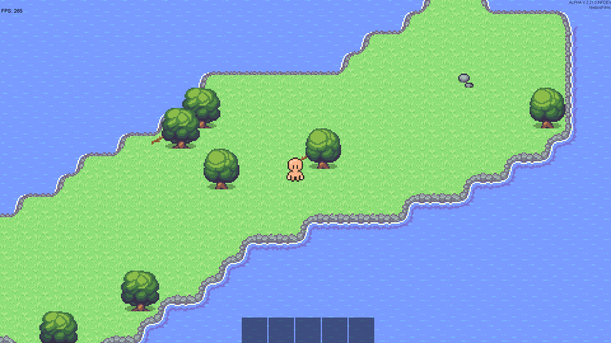

# Top Down Java Game
# THIS README IS DEPRECATED

[Game Developer Info](GAME_DEVELOPER_INFO.md)

This is a game i'm making in my spare time. 
Its made purely with Java.
 

------------------------------------------------------------------------

Game Version: `ALPHA V 2.21.0 INFDEV` 

------------------------------------------------------------------------

### Game Details
- Top down survival
- Dungeon crawler
- Bullet hell
- Exploring
- Gets increasingly more difficult

------------------------------------------------------------------------

### Current Version
- `ALPHA`
- [Exact Version](./src/game/system/main/Game.java#L31)

------------------------------------------------------------------------

### Big expected updates
1. `BETA` When the game is playable
2. `EARLY ACCESS` When the game has actual content

------------------------------------------------------------------------

### Contributers
##### Game Developer, Programmer and Game Director
- [NielzosFilms](https://github.com/NielzosFilms)
- [NielzosFilmsSchool](https://github.com/NielzosFilmsSchool)
##### Game Artists
- [TimoTie02](https://github.com/TimoTie02)
- [Sploem](https://github.com/Sploem)
##### Moral Support
- [Joris](https://github.com/JoristerWolbeek/)

------------------------------------------------------------------------

### Game Default Key Bindings
- `WASD` movement
- `Q` drop held item
- `I` open player inventory
- `SHIFT` hold to sprint
- `1-9` hotbar selection
- `ESC` pauze game
- `F4` debug mode
